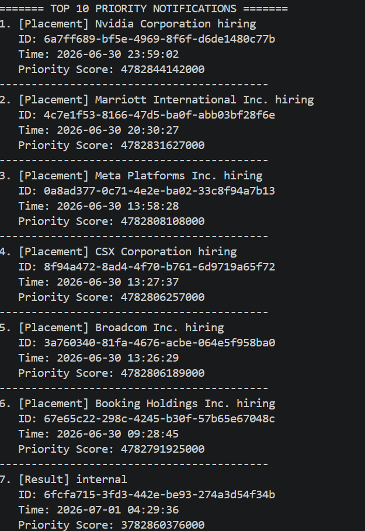

# Stage 1 – Notification Priority Inbox Design

## Objective
Implement a priority inbox that always shows the top 10 most important notifications based on **type weight** and **recency**.

## Approach

### 1. Weight Assignment
- Placement → weight = 3 (highest)
- Result → weight = 2
- Event → weight = 1 (lowest)

### 2. Recency Scoring
Each notification's timestamp is converted to milliseconds. Newer notifications have a larger value.

### 3. Combined Priority Score
`priority = (weight * 10^12) + timestamp_ms`
- Multiplying by `10^12` ensures type dominates sorting.
- Placement always beats Result, and Result always beats Event.
- Within the same type, newer notifications get higher priority.

### 4. Efficient Maintenance
A **min‑heap of fixed size 10** is used.
- Insert each notification.
- If heap is full and new priority > smallest, replace root and re-heapify.
- Complexity: O(log 10) ≈ O(1) per notification.

### 5. Handling New Notifications
For a real‑time stream, simply call `heap.insert(newItem)` to maintain the top 10 without re‑sorting.

### 6. Logging Middleware Integration
The logging middleware is integrated at key points:
- Before and after API fetch.
- On errors.
- During processing.
- When final output is displayed.

## Screenshot of Output

## Repository
All code, screenshots, and this markdown are pushed to the GitHub repository named after my roll number.